<p align="center">
  
</p>

<h1 align="center">Xcode</h1>

<p align="center">
  Komunitas mahasiswa yang belajar bersama, membangun project nyata, dan berkembang menjadi developer profesional.
</p>

<p align="center">
  
  
  
  
</p>

<p align="center">
  
  
  
</p>

<br/>

## Tentang Xcode

Xcode (Coding Developer Experience) adalah website untuk komunitas developer mahasiswa. Situs ini dirancang sebagai landing page hero yang hangat, terang, dan inspiratif — menampilkan ilustrasi kampus sebagai visual utama, dengan UI yang bersih dan premium agar setiap pengunjung langsung merasakan suasana komunitas yang ramah.

## Fitur

- Hero section editorial dengan ilustrasi komunitas sebagai elemen visual utama
- Animasi awan lembut yang bergerak perlahan pada area langit
- Judul dengan identitas warna khas Xcode: Build (biru), Learn (abu gelap), Together (kuning hangat)
- Search bar utama untuk mencari project, event, artikel, atau topik
- Tag populer: Next.js, Workshop, Hackathon, Open Source, UI/UX, React
- CTA utama: Join Community dan Explore Projects
- Navigasi minimal dengan hover underline, tombol rounded, dan efek skala halus
- Fade-in animation saat halaman dimuat
- Fully responsive

## Teknologi

- [Next.js 15](https://nextjs.org) — App Router
- [Tailwind CSS](https://tailwindcss.com) — styling
- [shadcn/ui](https://ui.shadcn.com) — komponen UI
- [Framer Motion](https://www.framer.com/motion/) — transisi & animasi
- TypeScript

## Cara Menjalankan

**Prasyarat:** Node.js 18.18 atau lebih baru.

```bash
# install dependencies
npm install

# jalankan development server
npm run dev
```

Buka [http://localhost:3001](http://localhost:3001) di browser. Catatan: port default 3000 mungkin sudah terpakai, sehingga Next.js otomatis memilih port 3001.

Untuk build produksi:

```bash
npm run build
npm run start
```

## Struktur Folder

```
app/            halaman dan layout (App Router)
components/     komponen React, termasuk hero
components/ui/  komponen shadcn/ui
lib/            utilitas (cn)
public/         aset statis, termasuk ilustrasi animasi
```

## Kontribusi

Repo ini adalah bagian dari upaya komunitas. Silakan buka _issue_ atau kirim _pull request_ untuk saran dan perbaikan.
